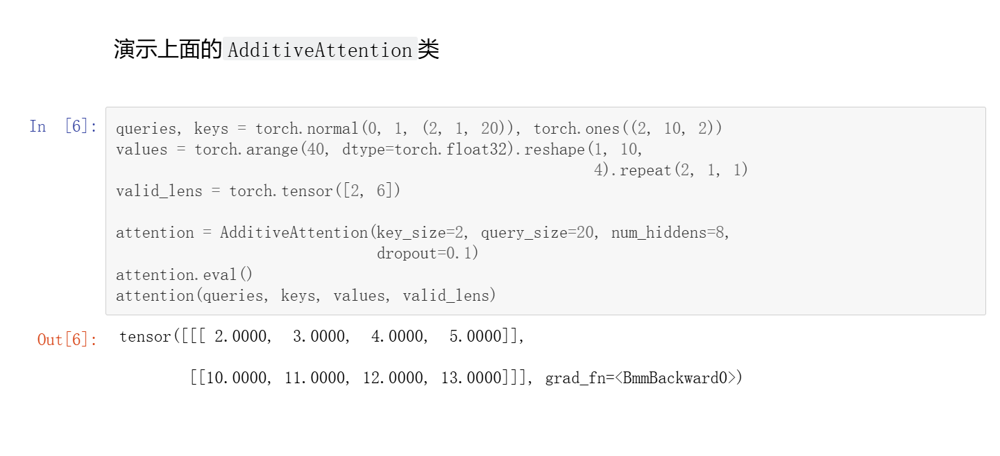
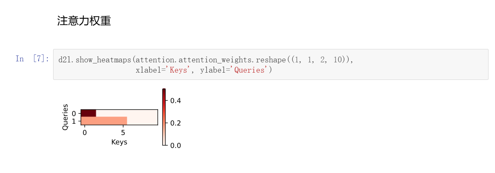
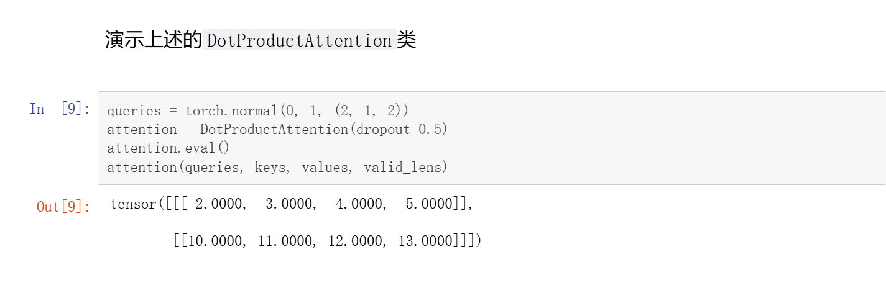
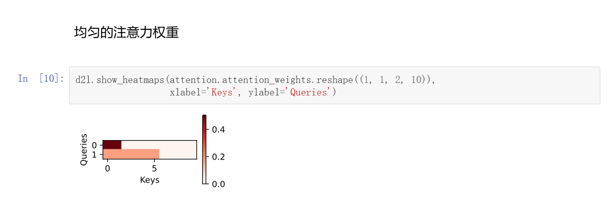

# Attention 代码解析
## 遮蔽softmax操作
这一步操作是为了解决填充信息的干扰问题
```Python
def masked_softmax(X, valid_lens):
    """通过在最后一个轴上遮蔽元素来执行 softmax 操作"""
    if valid_lens is None:
        # dim=-1表示在最后一维上(最底层)做softmax操作
        return nn.functional.softmax(X, dim=-1)
    else:
        # 假设X:(2,3,4) shape[0]=2 shape[1]=3 shape[2]=4 shape[-1]=4
        # valid_lens [1,2]
        shape = X.shape
        if valid_lens.dim() == 1:
            # 重复元素 [1,2] -> [1,1,1,2,2,2]
            # 此时X中有2x3=6个值，每个值的有效长分别为1,1,1,2,2,2
            valid_lens = torch.repeat_interleave(valid_lens, shape[1])
        else:
            # 展开 比如[[1,2,3],[1,2,3]] -> [1,2,3,1,2,3]
            valid_lens = valid_lens.reshape(-1)
        # 用-1e6替换无效部分
        X = d2l.sequence_mask(X.reshape(-1, shape[-1]), valid_lens,
                              value=-1e6)
        # X此时已经处理完毕，进行操作
        return nn.functional.softmax(X.reshape(shape), dim=-1)
```
总结：X在经过这个函数后形状与原来的X相同，只是做了softmax操作  
可以参考教程中的实例来验证上述解释  
## Addition Attention
```Python
class AdditiveAttention(nn.Module):
    """加性注意力"""
    # batch_size=2 num_hiddens=5
    # 假设 query_num=3,query_size=3 queries=(2,3,3) (batch_size,query_num,query_size)
    # key_size=4 key_num=6 keys=(2,6,4)
    # values=(2,6,4)
    def __init__(self, key_size, query_size, num_hiddens, dropout, **kwargs):
        super(AdditiveAttention, self).__init__(**kwargs)
        self.W_k = nn.Linear(key_size, num_hiddens, bias=False)
        self.W_q = nn.Linear(query_size, num_hiddens, bias=False)
        self.w_v = nn.Linear(num_hiddens, 1, bias=False)
        self.dropout = nn.Dropout(dropout)

    def forward(self, queries, keys, values, valid_lens):
        # queries=(2,3,3) keys=(2,6,4) -> queries=(2,3,5) keys=(2,6,5)
        queries, keys = self.W_q(queries), self.W_k(keys)
        # queries.unsqueeze(2)在第二维添加一个新维度，即(2,3,1,5)
        # keys.unsqueeze(1)在第一维添加一个新维度，即(2,1,6,5)
        # 每个查询向量和每个键向量相加，相加后广播 -> features=(2,3,6,5)
        features = queries.unsqueeze(2) + keys.unsqueeze(1)
        # 激活函数，将每个值压缩到[-1,1]
        features = torch.tanh(features)
        # (2,3,6,5) -> (2,3,6,1) 删除大小为1的维度-> (2,3,6)
        scores = self.w_v(features).squeeze(-1)
        # softmax 
        self.attention_weights = masked_softmax(scores, valid_lens)
        # bbm批量矩阵乘法 attention_weights(2,3,6) values(2,6,4) -> (2,3,4) 这里的3是query_num而不是query_size!
        # 相当与在第0维做内积
        return torch.bmm(self.dropout(self.attention_weights), values)
```
```
总结：输入querys，keys,values矩阵  
输出output=(batch_size,query_num,value_size)    
    attention_weights=(batch_size,query_num,key_num)
```
### 效果展示

```
query_num=1,query_size=20
batch_size=2两个样本，每个样本长度10，样本值长度4 
10个key key_size=2
有效长度valid_lens:第一个样本就看前两位，第二个样本就看前6位
输出长度(2,1,4)  符合上述output形状  
```

```
attention_weights=(2,1,10)
如图：y轴0,1表示两个样本，第一个样本注意力集中于前两个key
    第二个样本集中于前6个key
符合预期！
```
## 缩放点积注意力
```Python
class DotProductAttention(nn.Module):
    """缩放点积注意力"""
    def __init__(self, dropout, **kwargs):
        # 经典小连招，和之前Additive注意力一样
        super(DotProductAttention, self).__init__(**kwargs)
        self.dropout = nn.Dropout(dropout)

    def forward(self, queries, keys, values, valid_lens=None):
        # d是queries矩阵最后一维的大小，是query_size
        d = queries.shape[-1]
        # Q*KT/sqrt(d)
        scores = torch.bmm(queries, keys.transpose(1, 2)) / math.sqrt(d)
        self.attention_weights = masked_softmax(scores, valid_lens)
        return torch.bmm(self.dropout(self.attention_weights), values)
```

```
总结：反正无论采用哪一种算法，最终输出结果一定是
output=(batch_size,query_num,value_size)    
attention_weights=(batch_size,query_num,keys_num)
所以下面展示的权重图自然也差不多
```
