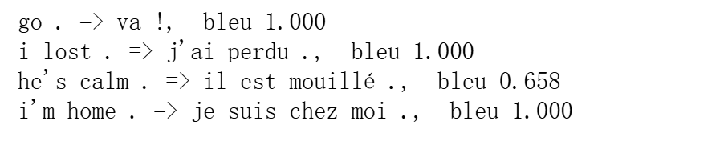

# seq2seq+attention-Code
## 解码器代码
### 接口
```Python
class AttentionDecoder(d2l.Decoder):
    """带有注意力机制的解码器基本接口"""
    def __init__(self, **kwargs):
        super(AttentionDecoder, self).__init__(**kwargs)

    @property
    def attention_weights(self):
        raise NotImplementedError
```
### 实现接口
#### 示意图

```Python
class Seq2SeqAttentionDecoder(AttentionDecoder):
    def __init__(self, vocab_size, embed_size, num_hiddens, num_layers,
                 dropout=0, **kwargs):
        super(Seq2SeqAttentionDecoder, self).__init__(**kwargs)
        # key_size=num_hiddens query_size=num_hiddens num_hiddens=num_hiddens
        self.attention = d2l.AdditiveAttention(num_hiddens, num_hiddens,
                                               num_hiddens, dropout)
        # 构建Embed
        self.embedding = nn.Embedding(vocab_size, embed_size)
        # embed_size+num_hiddens 是因为需要合并Embed和Attenrion的输出
        self.rnn = nn.GRU(embed_size + num_hiddens, num_hiddens, num_layers,
                          dropout=dropout)
        # 线性层，将RNN输出映射会词汇表大小
        self.dense = nn.Linear(num_hiddens, vocab_size)

    def init_state(self, enc_outputs, enc_valid_lens, *args):
        outputs, hidden_state = enc_outputs
        # permute调整维度，此处含义是原来0和1维交换
        # (seq_len, batch_size, feature_dim) -> (batch_size, seq_len, feature_dim)
        return (outputs.permute(1, 0, 2), hidden_state, enc_valid_lens)

    def forward(self, X, state):
        # X=(batch_size,seq_len,vocab_size)
        # enc_outputs=(batch_size, seq_len, num_hiddens)
        # hidden_state=(num_layers, batch_size, num_hiddens)
        # enc_valid_lens=? 可能一维可能多维，但这并不重要，之前谈论过关于valid_len的处理
        enc_outputs, hidden_state, enc_valid_lens = state

        # X -> (batch_size,seq_len,embed_size) -> (seq_len,batch_size,embed_size) 方便时间步处理
        # X是Target输入
        X = self.embedding(X).permute(1, 0, 2)
        outputs, self._attention_weights = [], []
        # x=(batch_size,embed_size)
        for x in X:
            # hidden_state[-1]表示最后的隐状态(batch_size,num_hiddens)
            # query=(batch_size,1,num_hiddens)
            query = torch.unsqueeze(hidden_state[-1], dim=1)
            # keys -> enc_outputs 
            # values -> enc_outputs
            # context=(batch_size,1,num_hiddens)
            # attention_weight=(batch_size,query_num=1,key_num=seq_len)
            context = self.attention(query, enc_outputs, enc_outputs,
                                     enc_valid_lens)
            # torch.unsqueeze(x, dim=1) -> (batch_size,1,embed_size)
            # 此处表示在最后一个维度上拼接 x=(batch_size,1,embed_size+num_hiddens)
            x = torch.cat((context, torch.unsqueeze(x, dim=1)), dim=-1)
            # x.permute=(1,batch_size,embed_size+num_hiddens)
            # hidden_state(in)=(num_layers, batch_size, num_hiddens)
            # out=(1,batch_size,num_hiddens)
            # hidden_state(out)=(num_layers, batch_size, num_hiddens)
            # 注意！这时候的hidden_state变成下一轮的query进入Attention层
            out, hidden_state = self.rnn(x.permute(1, 0, 2), hidden_state)
            outputs.append(out)
            # attention_weight=(batch_size,query_num=1,key_num=seq_len)
            self._attention_weights.append(self.attention.attention_weights)
        # outputs=(seq_len,batch_size,num_hiddens)
        # dense -> (seq_len,batch_size,vocab_size)
        outputs = self.dense(torch.cat(outputs, dim=0))
        return outputs.permute(1, 0, 2), [
            enc_outputs, hidden_state, enc_valid_lens]

    @property
    def attention_weights(self):
        return self._attention_weights
```
```
总结：带注意力机制的解码器
输入：Target输入X=(batch_size,seq_len,vocab_size)
    编码器信息
输出：outputs=(batch_size,seq_len,vocab_size)
```

## 训练&&预测
```Python
embed_size, num_hiddens, num_layers, dropout = 32, 32, 2, 0.1
batch_size, num_steps = 64, 10
lr, num_epochs, device = 0.005, 250, d2l.try_gpu()
# 加载数据
train_iter, src_vocab, tgt_vocab = d2l.load_data_nmt(batch_size, num_steps)
# 编码器
encoder = d2l.Seq2SeqEncoder(len(src_vocab), embed_size, num_hiddens,
                             num_layers, dropout)
# 解码器
decoder = Seq2SeqAttentionDecoder(len(tgt_vocab), embed_size, num_hiddens,
                                  num_layers, dropout)
# 合并
net = d2l.EncoderDecoder(encoder, decoder)
# 调用高级API训练
d2l.train_seq2seq(net, train_iter, lr, num_epochs, tgt_vocab, device)
```
预测
```Python
engs = ['go .', "i lost .", 'he\'s calm .', 'i\'m home .']
fras = ['va !', 'j\'ai perdu .', 'il est calme .', 'je suis chez moi .']
for eng, fra in zip(engs, fras):
    translation, dec_attention_weight_seq = d2l.predict_seq2seq(
        net, eng, src_vocab, tgt_vocab, num_steps, device, True)
    print(f'{eng} => {translation}, ',
          f'bleu {d2l.bleu(translation, fra, k=2):.3f}')
```


## 可视化注意力权重
```Python
# step[0][0][0]表示一个(seq_len,)的一维向量，之后将其在0维拼接，变成(seq_len*num_steps,)的向量
# 最后大小(1,1,seq_len,num_steps)
# 这里seq_len表示需要翻译的句子，num_steps表示源句子的长度
attention_weights = torch.cat(
    [step[0][0][0] for step in dec_attention_weight_seq], 0).reshape(
        (1, 1, -1, num_steps))
# 由以上示例知len(engs[-1].split())+1=4
d2l.show_heatmaps(
    attention_weights[:, :, :, :len(engs[-1].split()) + 1].cpu(),
    xlabel='Key posistions', ylabel='Query posistions')
```
