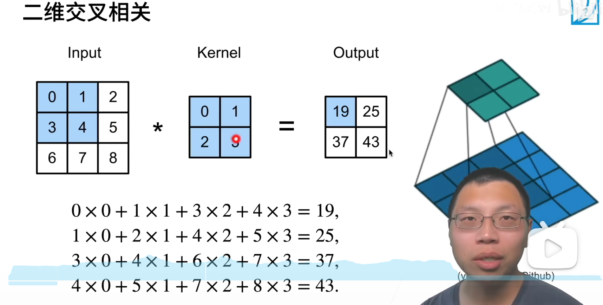

# 卷积层总结
## 什么卷积层？有什么用？
卷积层是用来解决全连接层参数过多问题而提出来的  
比如一张仅仅1000x1000图片，对于一层100个神经元的MLP,则会有1亿一个参数，内存吃不消。  
卷积层的核心思想是平移不变性和局部性。  
平移不变性直观上就是那一套参数不随着输入平移操作后改变，可以想象一张图片平移后在MLP的体系中老一套参数并不能适应，但是在卷积层体系中就能适应，从而减少参数量。这件事其实观看一个例子就能理解   
局部性则是在图像处理任务中大部分情况下只需关注一些局部的特征，意在减少参数

## 卷积是怎么算的？
如图


## 代码怎么表示？
```Python
import torch
from torch import nn
# 二维卷积运算函数
def conv2d(X,K):
    h, w=K.shape
    Y=torch.zeros((X.shape[0]-h+1,X.shape[1]-w+1))
    for i in range(Y.shape[0]):
        for j in range(Y.shape[1]):
            Y[i,j]=(X[i:i+h, j:j+w]*K).sum()
    return Y
# 实现二维卷积层
class Conv2D(nn.Moudle):
    def __init__(self, kernel_size):
        super().__init__()
        self.weight=nn.Parameter(torch.rand(kernel_size))
        self.bias=nn.Parameter(torch.zeros(1))

    def forword(self,x):
        return conv2d(x,self.weight)+self.bias

# 训练
conv2d=nn.Conv2D(1,1,kernel_size=(1,2),bias=False)
X=X.reshape((1,1,6,8))
Y=Y.reshape((1,1,6,7))
for i in range(10):
    Y_hat=conv2d(X)
    l=(Y_hat-Y)**2
    conv2d.zero_grad()
    l.sum().backward()
    conv2d.weight.data[:] -= 3e-2*conv2d.weight.grad
    if (i+1)%2==0:
        print(f'batch{i+1}, loss {l.sum():.3f}')
print(conv2d.weight.data.reshape((1,2)))
```