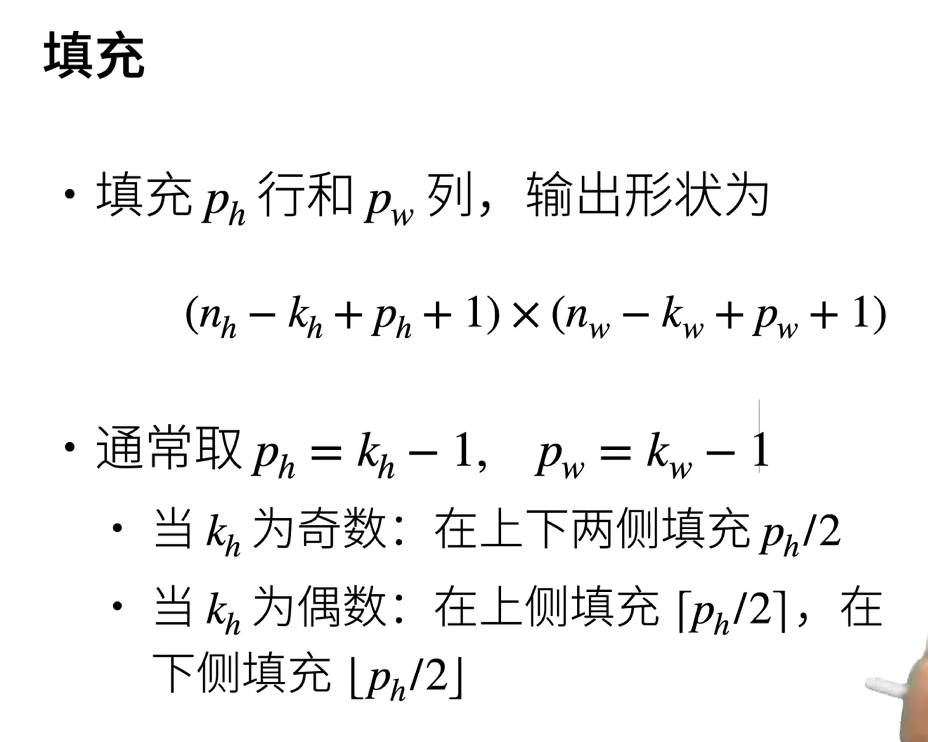
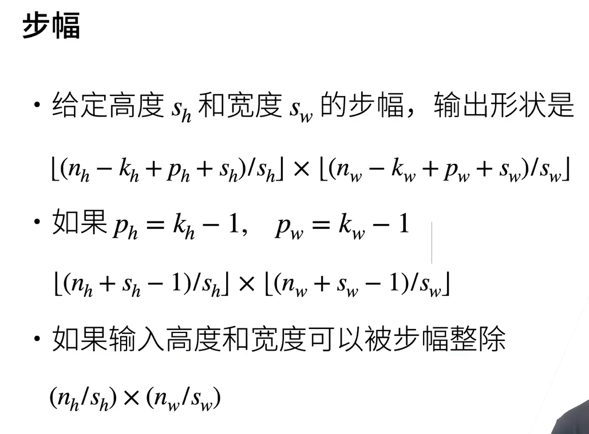

# 填充与步幅
## 基本概念



## 代码
通过padding参数控制填充量，stride参数控制步幅
padding=(2,1) 高度填充2，宽度填充1
padding=1
stride=2
stride=(1,2)
```Python
import torch
from torch import nn
def comp_conv2d(conv2d, X):
    X=X.reshape((1,1)+X.shape)
    Y=conv2d(X)
    return Y.reshape(Y.shape[2:])
conv2d=nn.Conv2d(1,1,kernel_size=3,padding=(2,1),stride=(2,1))
X=torch.rand(size=(8,8))
comp_conv2d(conv2d,X).shape
```