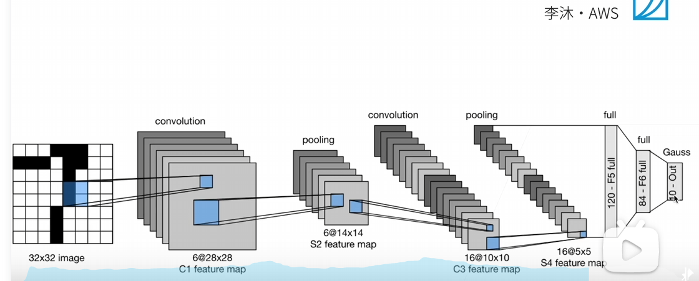

# P23 LeNet 经典卷积神经网络
## 起源？为了干什么？
80年代末为了进行手写数字识别任务搞出来的一个东西  
MNIST就是随之提出的一个数据集 
## 结构？
6@ 表示通道数

## 总结
卷积层学习空间信息  
池化层降低敏感度  
全连接层来转换到类别空间  
## 代码
```Python
import torch
form torch import nn
class Reshape(torch.nn.Module):
    def forward(self,x):
        return x.view(-1,1,28,28)
net = torch.nn.Sequential(
    Reshape(),nn.Conv2d(1,6,kernel_size=5,padding=2),nn.Sigmoid(),
    nn.AvgPool2d(2,stride=2),
    nn.Conv2d(6,16,kernel_size=5),nn.Sigmoid(),
    nn.AvgPool2d(kernel_size=2,stride=2),nn.Flatten(),
    nn.Linear(16*5*5,120),nn.Sigmoid(),
    nn.Linear(120,84),nn.Sigmoid(),
    nn.Linear(84,10)
)
```