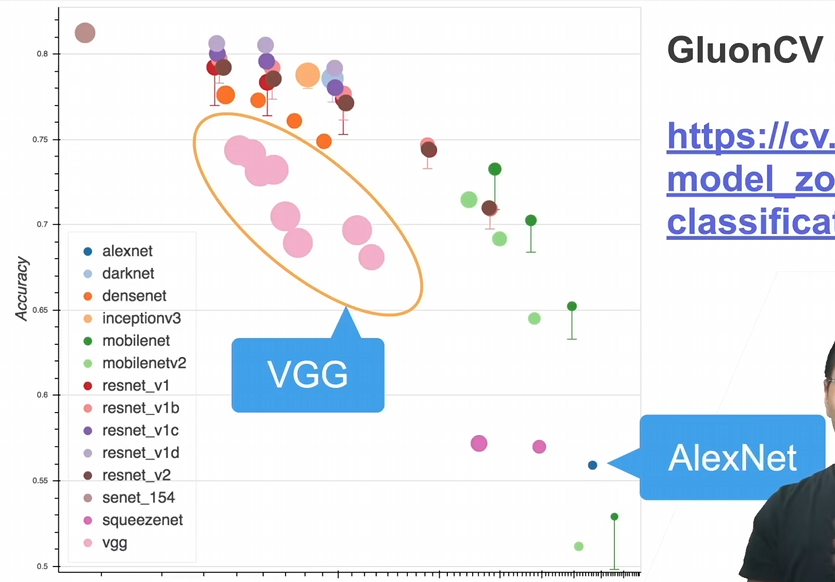

# VGG 使用块的网络
## 来源
为了加强AlexNet，使其更深更大，有什么做法？
选项
A.更多全连接层(太贵)
B.更多卷积层
C.将卷积层组合成块 -> VGG

## 架构
VGG块
    3x3卷积(padding=1)n层，m通道
    2x2最大池化层(stride=2) 
VGG架构
    多个VGG块后连接全连接层
    不同次数的重复块得到不同的架构VGG-16,VGG19

## 性能怎么样？

作为2013的网络，和新网络比，已经落后了

## 代码
```Python
import torch
from torch import nn
from d2l import torch as d2l

# 定义VGG块
def vgg_block(num_convs, in_channels, out_channels):
    layers = []
    for _ in range(num_convs):
        layers.append(nn.Conv2d(in_channels, out_channels,
                                kernel_size=3, padding=1))
        layers.append(nn.ReLU())
        in_channels = out_channels
    layers.append(nn.MaxPool2d(kernel_size=2,stride=2))
    return nn.Sequential(*layers)

#实现VGG11
def vgg(conv_arch):
    conv_blks = []
    in_channels = 1
    # 卷积层部分
    for (num_convs, out_channels) in conv_arch:
        conv_blks.append(vgg_block(num_convs, in_channels, out_channels))
        in_channels = out_channels

    return nn.Sequential(
        *conv_blks, nn.Flatten(),
        # 全连接层部分
        nn.Linear(out_channels * 7 * 7, 4096), nn.ReLU(), nn.Dropout(0.5),
        nn.Linear(4096, 4096), nn.ReLU(), nn.Dropout(0.5),
        nn.Linear(4096, 10))

net = vgg(conv_arch)
#构建一个高度和宽度为224的单通道数据样本，以观察每个层输出的形状。
X = torch.randn(size=(1, 1, 224, 224))
for blk in net:
    X = blk(X)
    print(blk.__class__.__name__,'output shape:\t',X.shape)
# 训练
# 构建网络
ratio = 4
small_conv_arch = [(pair[0], pair[1] // ratio) for pair in conv_arch]
net = vgg(small_conv_arch)
# 进行训练 与AlexNet类似
lr, num_epochs, batch_size = 0.05, 10, 128
train_iter, test_iter = d2l.load_data_fashion_mnist(batch_size, resize=224)
d2l.train_ch6(net, train_iter, test_iter, num_epochs, lr, d2l.try_gpu())
```