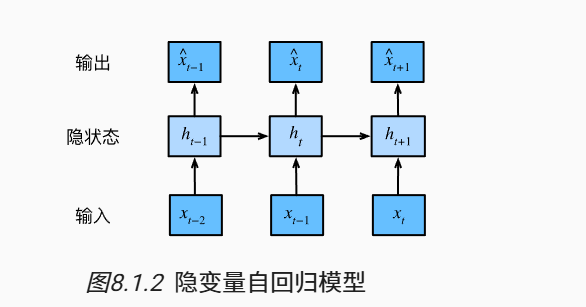
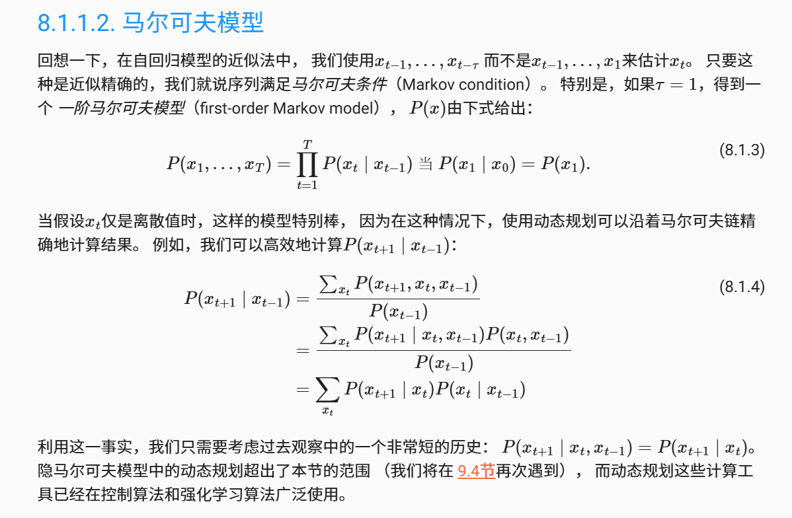

# 序列模型总结
## 关键概念
### Point1
自回归模型是利用自身过去数据预测未来，但使用全部数据不现实   
### Point2
潜变量(自回归)模型则是用潜变量h来概括历史信息,从而对模型实现简化   

### Point3
马尔科夫模型则是基于自回归模型但只用过去r个时间点的数据来预测当前状态，也是一种简化策略    

## 总结
总之，所谓序列模型，即输入样本是有顺序的，如时间顺序，整个预测过程也是按序输出的，上述的几个模型和策略只是希望介绍基本思想，本章的代码我感觉没啥用，有空看看即可。重点理解潜变量模型思想