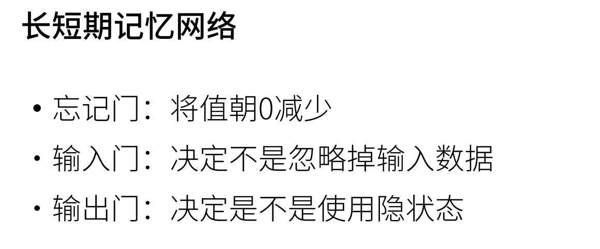
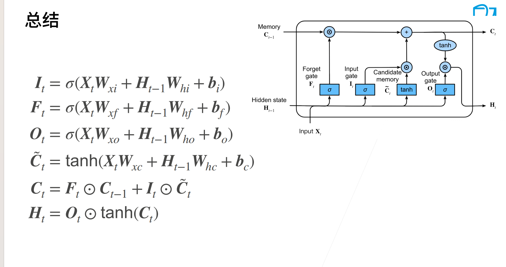
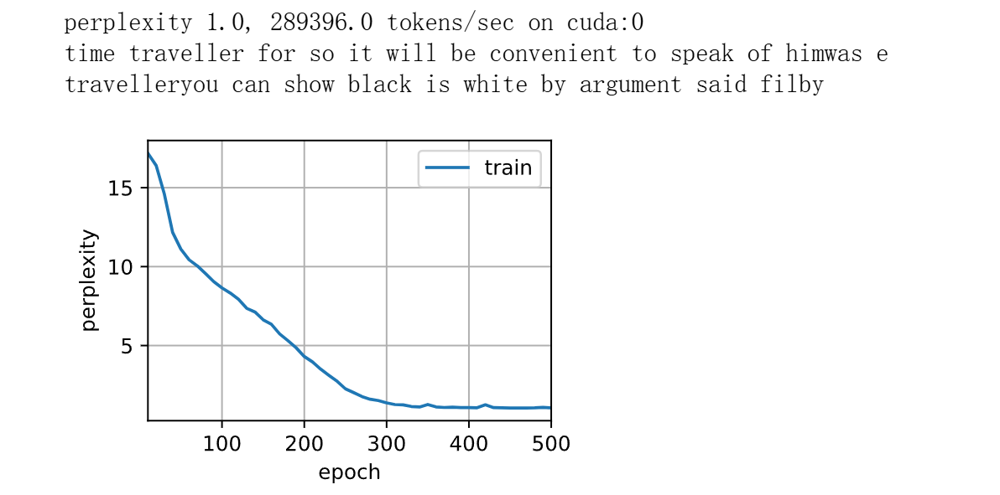

# LSTM
## 这是什么
类似于GRU,是一种Ht更新机制
## 概念


## 为什么有效
LSTM（长短时记忆网络）之所以有效，是因为它通过 三个门（输入门、遗忘门和输出门）来精细地控制信息的流动和记忆，解决了传统 RNN 在长序列训练中遇到的 梯度消失 和 梯度爆炸 问题。以下是这三个门的作用及其有效性：

遗忘门（Forget Gate）：控制忘记多少来自上一时刻的隐藏状态。这让网络能够选择性地丢弃不重要的信息，从而避免不相关的信息影响当前的学习过程。

输入门（Input Gate）：控制当前时刻的输入信息有多少应该被存储到 细胞状态（cell state）中。这样可以有效地将有用的信息长期保留，避免了信息的丢失。

输出门（Output Gate）：决定当前细胞状态的信息有多少应该传递到下一层或者作为当前时刻的隐藏状态。它允许模型根据当前的需要选择性地输出信息。

这三个门有效地管理了信息的保留、遗忘和输出，使得 LSTM 能够记住长期的依赖关系，同时避免了短期记忆的干扰，因此在处理长序列时表现优异。

## 代码(简洁实现)
```Python
num_inputs = vocab_size
lstm_layer = nn.LSTM(num_inputs, num_hiddens)
model = d2l.RNNModel(lstm_layer, len(vocab))
model = model.to(device)
d2l.train_ch8(model, train_iter, vocab, lr, num_epochs, device)
```
### 效果
