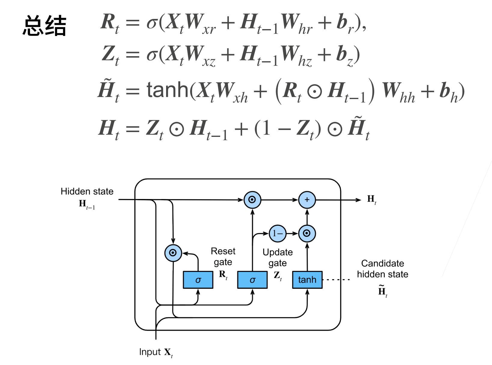
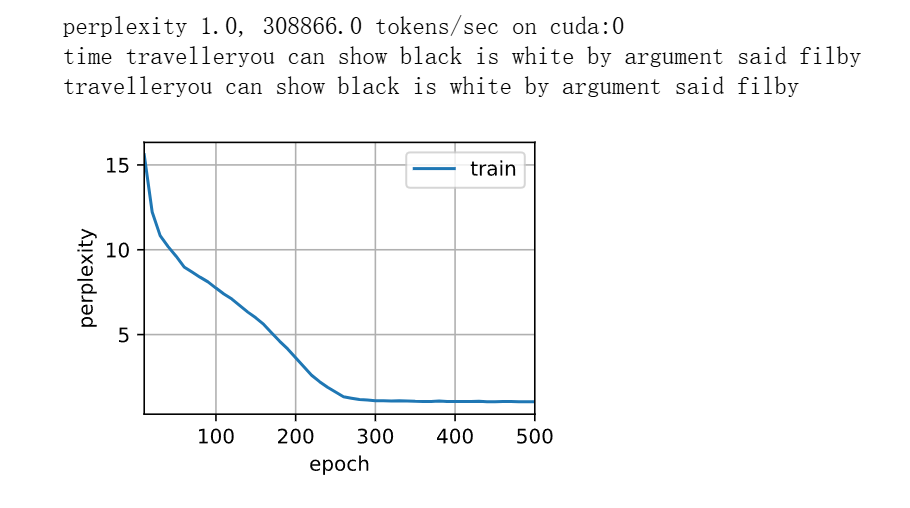

# GRU
## 这是什么
一种更新Ht的机制，目的是通过引入门控机制来更有效地学习和更新隐藏状态，从而解决传统RNN中的梯度消失问题和长程依赖问题。
## 概念
GRU 通过引入 更新门（Update Gate） 和 重置门（Reset Gate） 来控制隐藏状态的更新。GRU 的核心思想是使用门控来决定每个时间步的隐藏状态更新程度，从而增强网络对长期依赖的学习能力。  

GRU 中隐藏状态的更新机制：  
GRU 在每个时间步的隐藏状态更新机制是通过以下两个门控来控制的：  
更新门（Update Gate，记作zt）：控制当前隐藏状态有多少是由之前的隐藏状态传递过来的。它决定了模型是否将当前时刻的输入信息完全更新到隐藏状态中，还是保留先前的隐藏状态。  
重置门（Reset Gate，记作 rt）：控制当前输入信息与先前隐藏状态的结合程度。重置门决定了网络应该“遗忘”多少过去的信息，并根据这个决定如何生成当前的候选隐藏状态  

GRU的“更新隐藏状态机制”解释：  
GRU的隐藏状态更新机制可以通过以下几个关键点来理解：  

更新门𝑧𝑡控制当前隐藏状态是否需要被完全更新。如果𝑧𝑡 接近 1，表示当前输入的信息应该完全覆盖掉过去的隐藏状态。如果𝑧𝑡接近 0，表示隐藏状态几乎不更新，保留上一个时刻的隐藏状态。  
重置门𝑟𝑡控制过去信息的遗忘程度。当𝑟𝑡接近 0 时，表示遗忘过去的状态，只关注当前输入信息；而当𝑟𝑡接近 1 时，则表示完全保留过去的隐藏状态，并结合当前输入信息进行更新。。  

GRU与LSTM的比较：
LSTM（长短时记忆网络） 使用了三个门（输入门、遗忘门和输出门）来控制信息的流动，而 GRU 仅使用了两个门（更新门和重置门）。尽管 GRU 的门控机制比 LSTM 简单，但其表现通常与 LSTM 相当，且训练速度较快。
GRU 是通过 更新门 来决定隐藏状态的更新程度，这在很多任务中是足够有效的。

## 公式



## 代码(只展示简洁实现)
```Python
num_inputs = vocab_size
gru_layer = nn.GRU(num_inputs, num_hiddens)
model = d2l.RNNModel(gru_layer, len(vocab))
model = model.to(device)
d2l.train_ch8(model, train_iter, vocab, lr, num_epochs, device)
```

### 效果
