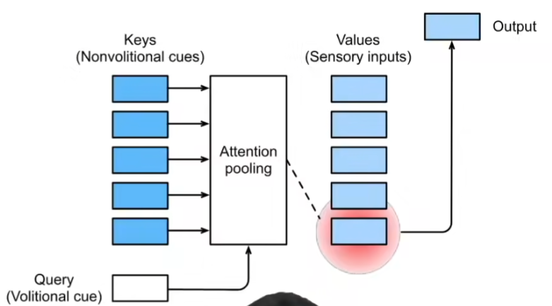
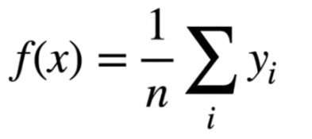
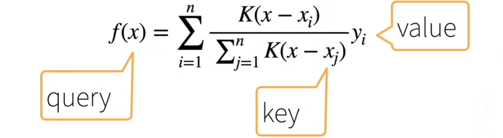
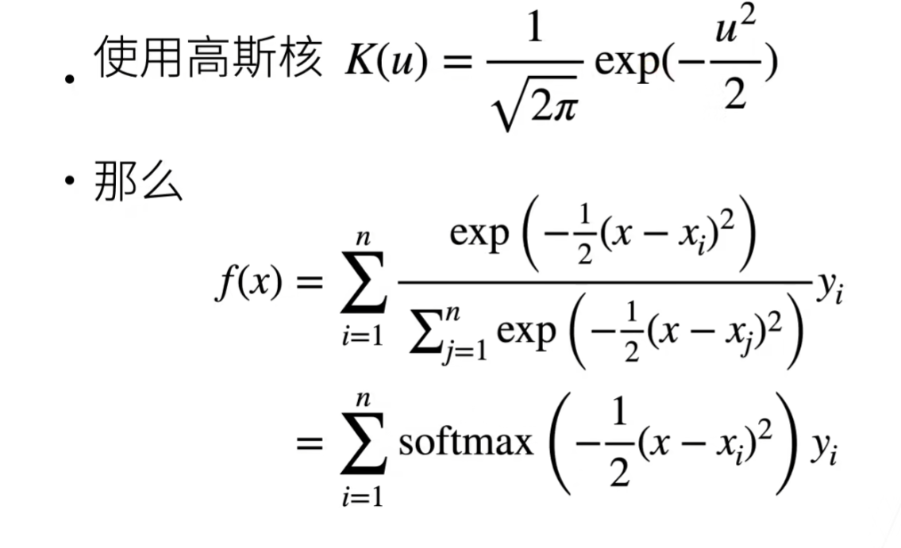
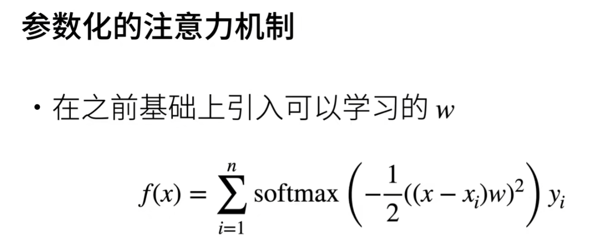
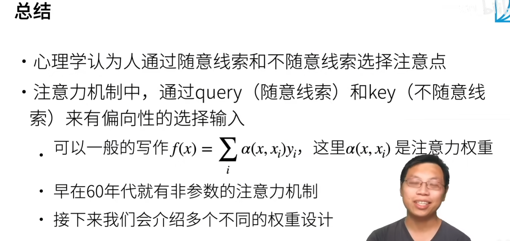

# 注意力机制
## 概念
随意线索：称查询query,表示当前需要关注的内容。  
不随意线索：称key,每个输入是value和key组成的对  
通过注意力池化层来有偏向性的选择某些输入  

## 实现手段
### 非参注意力池化层
给定数据(xi,yi)  
1.平均池化  
x表示query  

2.Nadaraya-Watson核回归  
K是一个衡量x与xi之间距离的函数  

比如使用高斯核  

### 参数化

w是可学习的参数  

## 总结

## 代码
代码部分是一个实现高斯核的示例，与后面关系不大，所以不做展示
