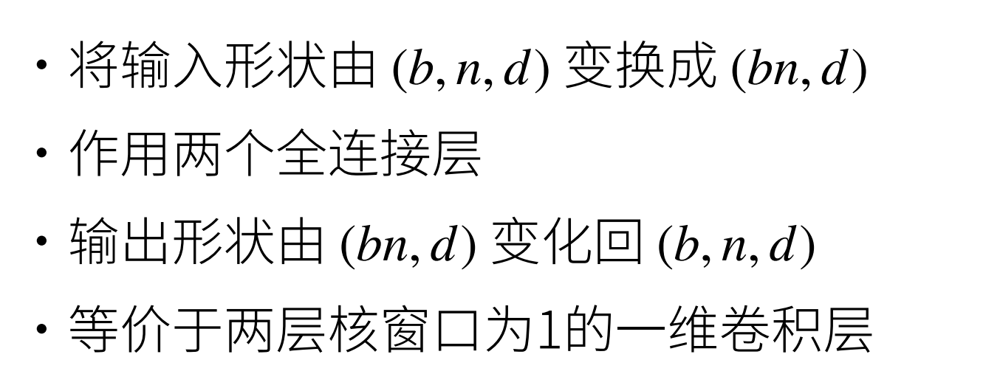

# Transformer
## 写在前面
代码解释重在关注输入输出形式，以及展示Transformer架构运行的原理  
本章实现的模块：  
1.Positionwise FFN  
2.Add & norm  
3.串联形成编码器  
4.串联形成解码器  
## 整体结构

编码器-解码器结构，纯使用注意力，两边都有n个Transformer块
## 多头注意力 Muti-head attention

## 有掩码的多头注意力 Masked Muti-head attention
简而言之解码器对序列中的一个元素输出时，不应该考虑该元素之后的元素。可以通过掩码机制来实现。即计算xi输出时假设当前序列的长度为i。  
## 基于位置的前馈网络  Positionwise FFN

## 归一化 Add & norm


## 编码器解码器交互-信息传递


## 预测过程


# Transformer代码
## 前置导入
```Python
import math
import pandas as pd
import torch
from torch import nn
from d2l import torch as d2l
```

## Positionwise FFN
```Python
class PositionWiseFFN(nn.Module):
    def __init__(self, ffn_num_input, ffn_num_hiddens, ffn_num_outputs,
                 **kwargs):
        super(PositionWiseFFN, self).__init__(**kwargs)
        # 全连接层1
        self.dense1 = nn.Linear(ffn_num_input, ffn_num_hiddens)
        # 激活函数relu
        self.relu = nn.ReLU()
        # 全连接层2
        self.dense2 = nn.Linear(ffn_num_hiddens, ffn_num_outputs)

    def forward(self, X):
        return self.dense2(self.relu(self.dense1(X)))
```
```
假设模型Token维度d_model
一般ffn_num_input=ffn_num_outputs=d_model
即使不等于，也仅仅对最后一个维度进行修改
输入：X=(batch_size,seq_len,ffn_num_input)
经过dense1: X1=(batch_size,seq_len,ffn_num_hiddens)
经过relu函数：X2=(batch_size,seq_len,ffn_num_hiddens)
经过dense2: output=(batch_size,seq_len,ffn_num_outputs)
```
### FFN效果展示


## Add&Norm 残差连接和层归一化  
```Python
class AddNorm(nn.Module):
    def __init__(self, normalized_shape, dropout, **kwargs):
        super(AddNorm, self).__init__(**kwargs)
        self.dropout = nn.Dropout(dropout)
        self.ln = nn.LayerNorm(normalized_shape)

    # LayerNorm是归一化操作
    # self.dropout(Y)+X是残差连接操作
    def forward(self, X, Y):
        return self.ln(self.dropout(Y) + X)
```
输入输出形状分析：
```
假设Token维度为d_model
这里X是模块的原始输入，Y是上一级的输出
输入 X=(batch_size,seq_len,d_model)
    Y=(batch_size,seq_len,d_model)
残差连接操作：
dropout是逐元素操作，不改变形状，相加也不改变
归一化操作：
归一化对最后一个维度即d_model进行归一化，也不改变形状

所以输出形状Output=(batch_size,seq_len,d_model)
```
### 为什么要用层归一化

### Add&Norm效果展示


## 实现一个编码器层
```Python
# 简单堆叠过去实现的模块
class EncoderBlock(nn.Module):
    def __init__(self, key_size, query_size, value_size, num_hiddens,
                 norm_shape, ffn_num_input, ffn_num_hiddens, num_heads,
                 dropout, use_bias=False, **kwargs):
        super(EncoderBlock, self).__init__(**kwargs)
        self.attention = d2l.MultiHeadAttention(key_size, query_size,
                                                value_size, num_hiddens,
                                                num_heads, dropout, use_bias)
        self.addnorm1 = AddNorm(norm_shape, dropout)
        self.ffn = PositionWiseFFN(ffn_num_input, ffn_num_hiddens,
                                   num_hiddens)
        self.addnorm2 = AddNorm(norm_shape, dropout)

    def forward(self, X, valid_lens):
        Y = self.addnorm1(X, self.attention(X, X, X, valid_lens))
        return self.addnorm2(Y, self.ffn(Y))
```
### 效果


## 实现编码器
```Python
class TransformerEncoder(d2l.Encoder):
    def __init__(self, vocab_size, key_size, query_size, value_size,
                 num_hiddens, norm_shape, ffn_num_input, ffn_num_hiddens,
                 num_heads, num_layers, dropout, use_bias=False, **kwargs):
        super(TransformerEncoder, self).__init__(**kwargs)
        self.num_hiddens = num_hiddens
        self.embedding = nn.Embedding(vocab_size, num_hiddens)
        # 位置编码层
        self.pos_encoding = d2l.PositionalEncoding(num_hiddens, dropout)
        # 一种容器，可以堆叠多个层
        self.blks = nn.Sequential()
        for i in range(num_layers):
            self.blks.add_module(
                "block" + str(i),
                EncoderBlock(key_size, query_size, value_size, num_hiddens,
                             norm_shape, ffn_num_input, ffn_num_hiddens,
                             num_heads, dropout, use_bias))

    def forward(self, X, valid_lens, *args):
        # 位置编码+embed
        X = self.pos_encoding(self.embedding(X) * math.sqrt(self.num_hiddens))
        self.attention_weights = [None] * len(self.blks)
        for i, blk in enumerate(self.blks):
            X = blk(X, valid_lens)
            self.attention_weights[
                i] = blk.attention.attention.attention_weights
        return X
```

### 效果


## 实现一个解码器层
```Python
class DecoderBlock(nn.Module):
    """解码器中第 i 个块"""
    def __init__(self, key_size, query_size, value_size, num_hiddens,
                 norm_shape, ffn_num_input, ffn_num_hiddens, num_heads,
                 dropout, i, **kwargs):
        super(DecoderBlock, self).__init__(**kwargs)
        # 标注自身序号
        self.i = i
        # 自注意力层1
        self.attention1 = d2l.MultiHeadAttention(key_size, query_size,
                                                 value_size, num_hiddens,
                                                 num_heads, dropout)
        # AddNorm1                                          
        self.addnorm1 = AddNorm(norm_shape, dropout)
        # 自注意力层2
        self.attention2 = d2l.MultiHeadAttention(key_size, query_size,
                                                 value_size, num_hiddens,
                                                 num_heads, dropout)
        # AddNorm2
        self.addnorm2 = AddNorm(norm_shape, dropout)
        # FFN
        self.ffn = PositionWiseFFN(ffn_num_input, ffn_num_hiddens,
                                   num_hiddens)
        # AddNorm3
        self.addnorm3 = AddNorm(norm_shape, dropout)

    def forward(self, X, state):
        # 提取编码器输出
        enc_outputs, enc_valid_lens = state[0], state[1]
        # 检查历史缓存信息
        if state[2][self.i] is None:
            key_values = X
        else:
            # 如果历史信息存在，则在维度1上进行拼接
            key_values = torch.cat((state[2][self.i], X), axis=1)
        # 更新历史信息
        # 在这种机制下，第i个模块只能看到第i个词以前的信息
        state[2][self.i] = key_values
        # 训练的时候由于步长固定，所以生成有效长度数组
        if self.training:
            batch_size, num_steps, _ = X.shape
            dec_valid_lens = torch.arange(1, num_steps + 1,
                                          device=X.device).repeat(
                                              batch_size, 1)
        else:
            dec_valid_lens = None

        # 拼接模块
        X2 = self.attention1(X, key_values, key_values, dec_valid_lens)
        Y = self.addnorm1(X, X2)
        Y2 = self.attention2(Y, enc_outputs, enc_outputs, enc_valid_lens)
        Z = self.addnorm2(Y, Y2)
        return self.addnorm3(Z, self.ffn(Z)), state
```


## 实现解码器
```Python
class TransformerDecoder(d2l.AttentionDecoder):
    def __init__(self, vocab_size, key_size, query_size, value_size,
                 num_hiddens, norm_shape, ffn_num_input, ffn_num_hiddens,
                 num_heads, num_layers, dropout, **kwargs):
        super(TransformerDecoder, self).__init__(**kwargs)
        self.num_hiddens = num_hiddens
        self.num_layers = num_layers
        # 处理输入
        self.embedding = nn.Embedding(vocab_size, num_hiddens)
        self.pos_encoding = d2l.PositionalEncoding(num_hiddens, dropout)
        # 模块容器
        self.blks = nn.Sequential()
        # 装载模块
        for i in range(num_layers):
            self.blks.add_module(
                "block" + str(i),
                DecoderBlock(key_size, query_size, value_size, num_hiddens,
                             norm_shape, ffn_num_input, ffn_num_hiddens,
                             num_heads, dropout, i))
        self.dense = nn.Linear(num_hiddens, vocab_size)

    # 初始化状态
    def init_state(self, enc_outputs, enc_valid_lens, *args):
        return [enc_outputs, enc_valid_lens, [None] * self.num_layers]

    def forward(self, X, state):
        # 输入
        X = self.pos_encoding(self.embedding(X) * math.sqrt(self.num_hiddens))
        # 初始化注意力权重存储
        self._attention_weights = [[None] * len(self.blks) for _ in range(2)]
        for i, blk in enumerate(self.blks):
            # forward
            X, state = blk(X, state)
            # 提取注意力权重
            self._attention_weights[0][
                i] = blk.attention1.attention.attention_weights
            self._attention_weights[1][
                i] = blk.attention2.attention.attention_weights
        return self.dense(X), state

    @property
    def attention_weights(self):
        return self._attention_weights
```

## 训练
```Python
num_hiddens, num_layers, dropout, batch_size, num_steps = 32, 2, 0.1, 64, 10
lr, num_epochs, device = 0.005, 200, d2l.try_gpu()
ffn_num_input, ffn_num_hiddens, num_heads = 32, 64, 4
key_size, query_size, value_size = 32, 32, 32
norm_shape = [32]

train_iter, src_vocab, tgt_vocab = d2l.load_data_nmt(batch_size, num_steps)

encoder = TransformerEncoder(len(src_vocab), key_size, query_size, value_size,
                             num_hiddens, norm_shape, ffn_num_input,
                             ffn_num_hiddens, num_heads, num_layers, dropout)
decoder = TransformerDecoder(len(tgt_vocab), key_size, query_size, value_size,
                             num_hiddens, norm_shape, ffn_num_input,
                             ffn_num_hiddens, num_heads, num_layers, dropout)
net = d2l.EncoderDecoder(encoder, decoder)
d2l.train_seq2seq(net, train_iter, lr, num_epochs, tgt_vocab, device)
```


## 预测-将英语翻译成法语
```Python
engs = ['go .', "i lost .", 'he\'s calm .', 'i\'m home .']
fras = ['va !', 'j\'ai perdu .', 'il est calme .', 'je suis chez moi .']
for eng, fra in zip(engs, fras):
    translation, dec_attention_weight_seq = d2l.predict_seq2seq(
        net, eng, src_vocab, tgt_vocab, num_steps, device, True)
    print(f'{eng} => {translation}, ',
          f'bleu {d2l.bleu(translation, fra, k=2):.3f}')
```


## 可视化注意力权重(此处略)