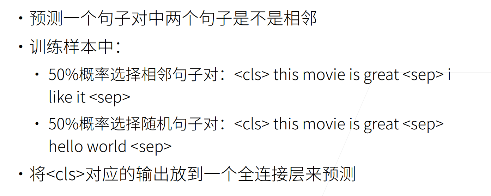

# BERT 预训练
## BERT动机
Bidirectional Encoder Representations from Transformers  
基于微调的NLP模型，预训练的模型已经抽取了足够多的信息，所以在进行新的任务时只需要增加一个简单的输出层  
## BERT架构

## 修改输入
每个样本是一个句子对，加入额外的片段嵌入(Segement Embeddings),且位置编码可学习。如下图所示  

## 预训练的任务  
### 1.带掩码的语言模型

### 2.下一个句子预测
